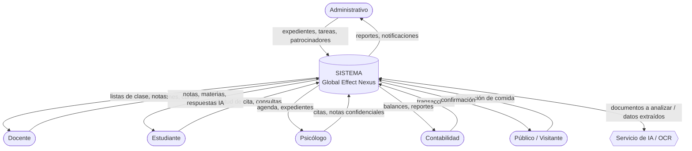
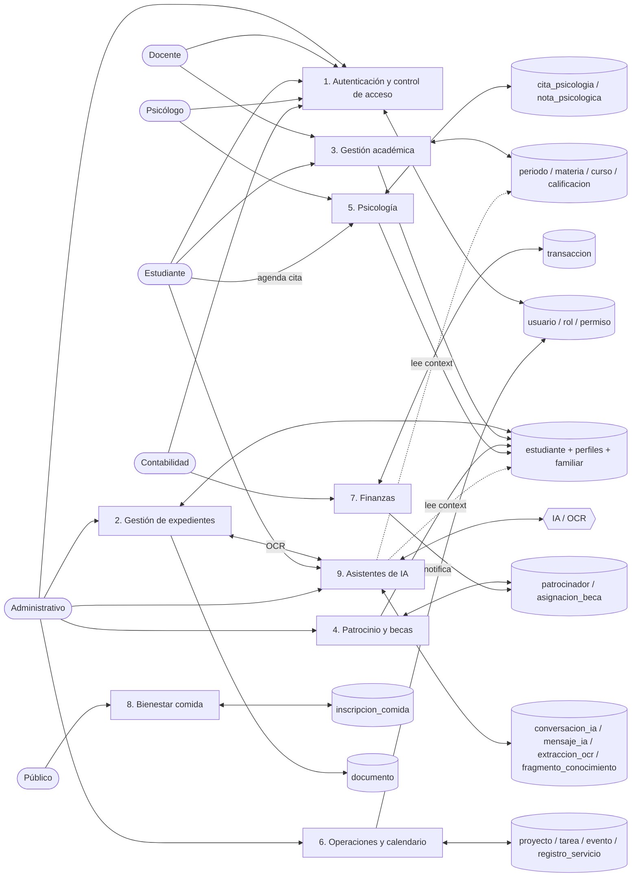
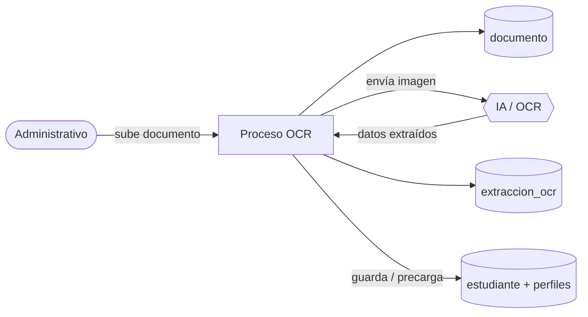
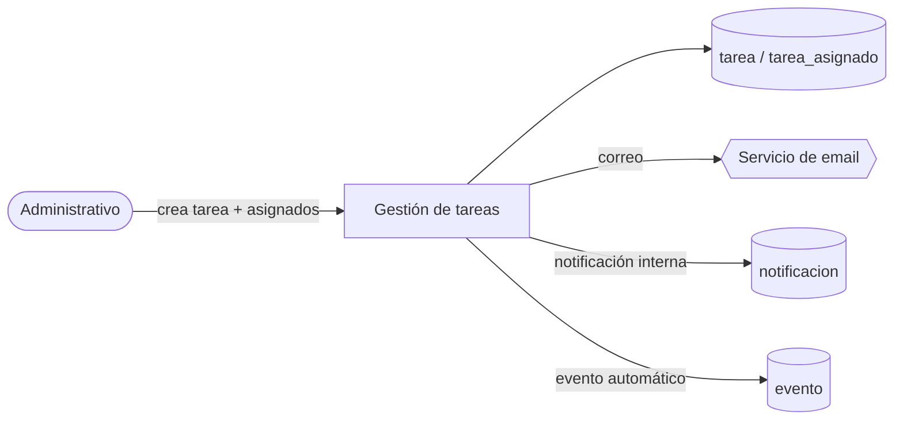
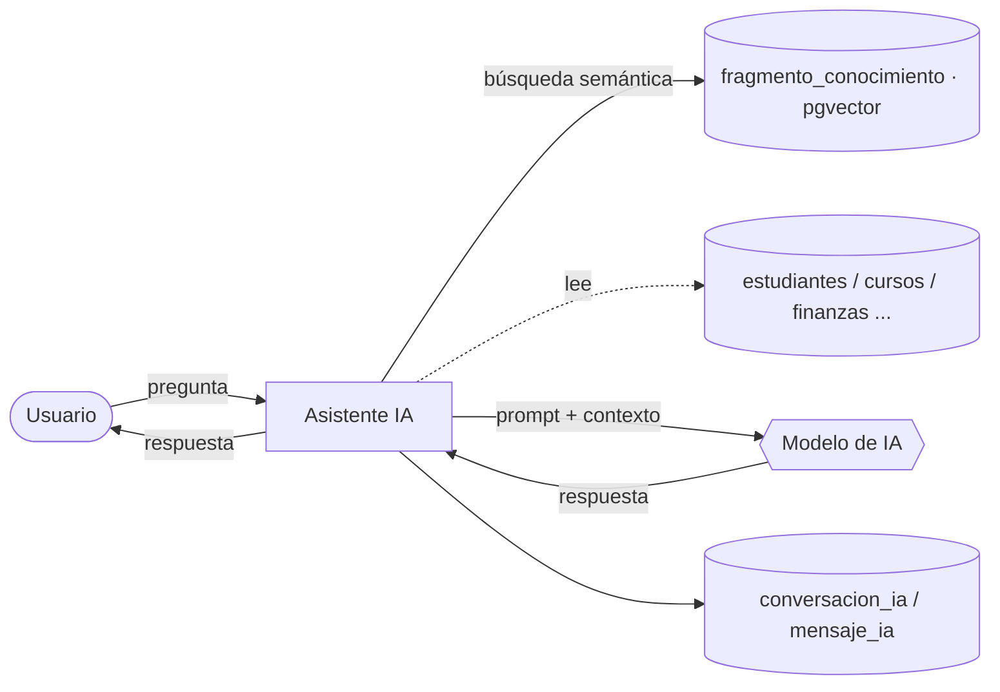

# Diagrama de Flujo de Datos (DFD) — Global Effect Nexus

> Parte de la **Cuarta Entrega** de la tesis (junto al ERD y el Diccionario de Datos).
> Representa cómo fluyen los datos entre las entidades externas (usuarios por rol), los procesos del sistema y los almacenes de datos (tablas).
> Diagramas en **Mermaid**. Convención DFD: **entidad externa** (quién interactúa), **proceso** (transforma datos), **almacén de datos** (dónde se guardan).

---

## 1. Nivel 0 — Diagrama de contexto

Visión general: quién usa el sistema y qué información intercambia con él.

---

## 2. Nivel 1 — Procesos principales y almacenes

Descomposición del sistema en sus procesos y los almacenes (tablas) que leen/escriben.

---

## 3. Flujos automatizados clave (detalle)

Procesos con lógica de negocio encadenada (coinciden con los flujos del sistema):

### 3.1 OCR → Expediente

### 3.2 Tarea → Notificación → Calendario

### 3.3 Chat IA con contexto (RAG)

---

## 4. Correspondencia procesos ↔ tablas ↔ permisos (RBAC)

| Proceso | Almacenes (tablas) | Permiso requerido |
|---|---|---|
| 1. Autenticación / acceso | `usuario`, `rol`, `permiso`, `rol_permiso` | — (login) / `usuarios.administrar` |
| 2. Expedientes | `estudiante`, `perfil_*`, `familiar`, `documento` | `expedientes.leer` / `.escribir` |
| 3. Académico | `periodo`, `materia`, `curso`, `inscripcion`, `calificacion`, `historial_calificacion` | `academico.*`, `calificaciones.registrar` |
| 4. Patrocinio y becas | `patrocinador`, `asignacion_beca` | `patrocinadores.*` |
| 5. Psicología | `cita_psicologia`, `nota_psicologica`, `perfil_psicologico` | `psicologia.leer` / `.escribir` |
| 6. Operaciones | `proyecto`, `tarea`, `tarea_asignado`, `evento`, `registro_servicio`, `notificacion` | `operaciones.*` |
| 7. Finanzas | `transaccion` | `finanzas.leer` / `.escribir` |
| 8. Bienestar (comida) | `inscripcion_comida` | — (público) |
| 9. Asistentes de IA | `conversacion_ia`, `mensaje_ia`, `extraccion_ocr`, `fragmento_conocimiento` | `ia.usar` / `ia.administrar` |

> El proceso **1** es transversal: todo acceso a los procesos 2–7 y 9 pasa antes por autenticación y verificación de permisos (RBAC).
