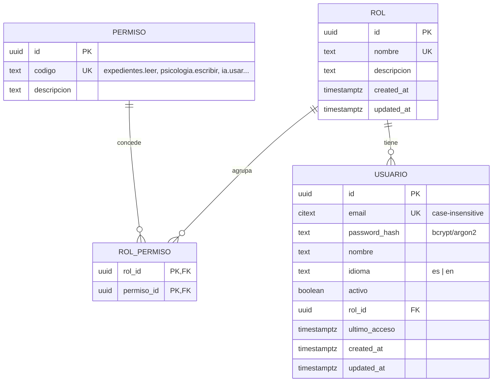
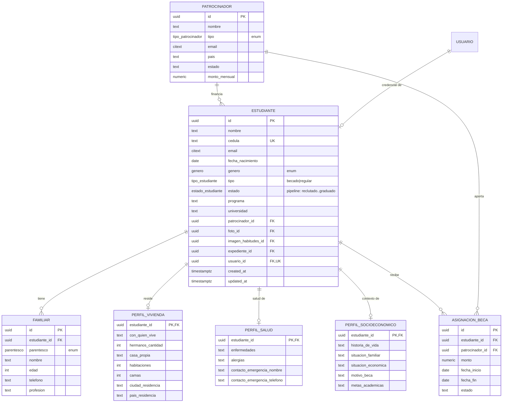
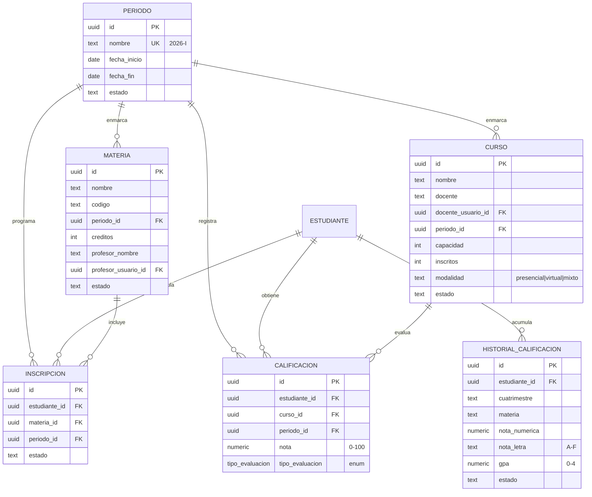
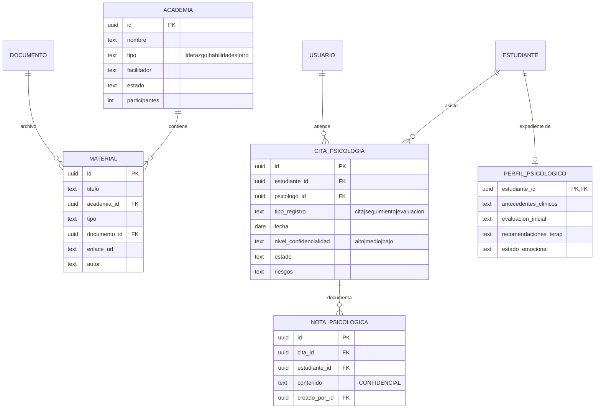
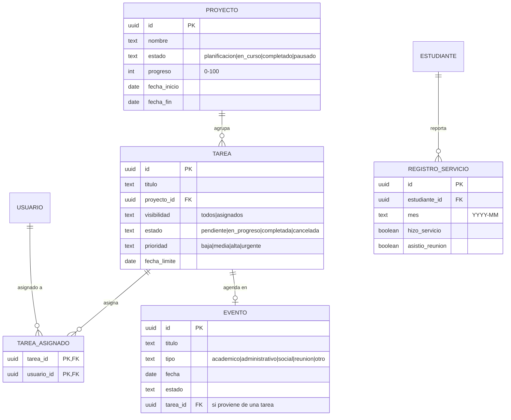
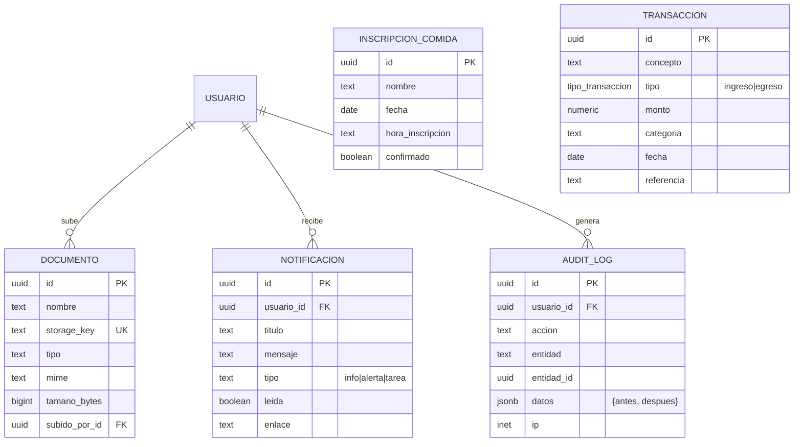
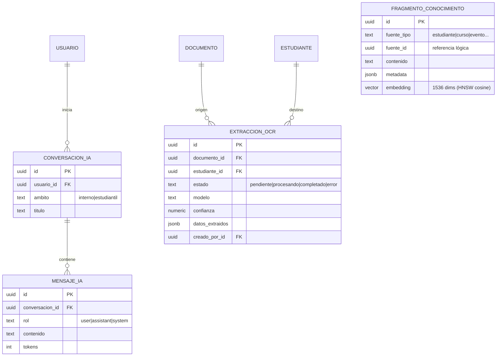

# Diagrama Entidad-Relación — Global Effect Nexus

> Base de datos: **PostgreSQL 17 (Supabase)**. Este ERD refleja exactamente el esquema desplegado por las migraciones `db/migrations/0001`–`0012` (36 tablas, 7 enums, pgvector para IA).
> Los diagramas están en sintaxis **Mermaid** (se renderizan en GitHub, VS Code, Obsidian o [mermaid.live](https://mermaid.live)).

## Convenciones

- **PK** = clave primaria · **FK** = clave foránea · **UK** = único.
- Cardinalidades: `||--o{` = uno-a-muchos · `||--||` / `||--o|` = uno-a-uno · `}o--o{` = muchos-a-muchos (resuelto con tabla intermedia).
- Todas las PK son `UUID` (`gen_random_uuid()`), y las tablas con `updated_at` tienen trigger de auditoría de fecha.

---

## 1. Diagrama global (relaciones entre dominios)

```mermaid
erDiagram
  ROL                     ||--o{ USUARIO                : tiene
  ROL                     ||--o{ ROL_PERMISO            : agrupa
  PERMISO                 ||--o{ ROL_PERMISO            : concede
  USUARIO                 ||--o| ESTUDIANTE            : "credencial de"
  USUARIO                 ||--o{ NOTIFICACION           : recibe
  USUARIO                 ||--o{ AUDIT_LOG              : genera
  USUARIO                 ||--o{ DOCUMENTO              : sube
  USUARIO                 ||--o{ CITA_PSICOLOGIA        : atiende
  USUARIO                 ||--o{ TAREA_ASIGNADO         : "asignado a"
  USUARIO                 ||--o{ CONVERSACION_IA        : inicia

  PATROCINADOR            ||--o{ ESTUDIANTE            : financia
  PATROCINADOR            ||--o{ ASIGNACION_BECA        : aporta

  ESTUDIANTE              ||--o{ FAMILIAR               : tiene
  ESTUDIANTE              ||--o| PERFIL_VIVIENDA        : reside
  ESTUDIANTE              ||--o| PERFIL_SALUD           : "salud de"
  ESTUDIANTE              ||--o| PERFIL_SOCIOECONOMICO  : "contexto de"
  ESTUDIANTE              ||--o| PERFIL_PSICOLOGICO     : "expediente psicológico"
  ESTUDIANTE              ||--o{ ASIGNACION_BECA        : recibe
  ESTUDIANTE              ||--o{ INSCRIPCION            : matricula
  ESTUDIANTE              ||--o{ CALIFICACION           : obtiene
  ESTUDIANTE              ||--o{ HISTORIAL_CALIFICACION : acumula
  ESTUDIANTE              ||--o{ CITA_PSICOLOGIA        : asiste
  ESTUDIANTE              ||--o{ NOTA_PSICOLOGICA       : "notas de"
  ESTUDIANTE              ||--o{ REGISTRO_SERVICIO      : reporta
  ESTUDIANTE              ||--o{ EXTRACCION_OCR         : "OCR de"

  DOCUMENTO               ||--o{ ESTUDIANTE            : "foto/expediente"
  DOCUMENTO               ||--o{ MATERIAL              : archivo
  DOCUMENTO               ||--o{ EXTRACCION_OCR         : origen

  PERIODO                 ||--o{ MATERIA               : enmarca
  PERIODO                 ||--o{ CURSO                 : enmarca
  PERIODO                 ||--o{ INSCRIPCION           : programa
  PERIODO                 ||--o{ CALIFICACION           : registra
  MATERIA                 ||--o{ INSCRIPCION           : incluye
  CURSO                   ||--o{ CALIFICACION           : evalua

  ACADEMIA                ||--o{ MATERIAL              : contiene

  CITA_PSICOLOGIA         ||--o{ NOTA_PSICOLOGICA       : documenta

  PROYECTO                ||--o{ TAREA                 : agrupa
  TAREA                   ||--o{ TAREA_ASIGNADO         : asigna
  TAREA                   ||--o| EVENTO                : "agenda en"

  CONVERSACION_IA         ||--o{ MENSAJE_IA            : contiene
```

> `TRANSACCION`, `INSCRIPCION_COMIDA` y `FRAGMENTO_CONOCIMIENTO` son entidades sin FK entrantes en el grafo principal (se detallan por dominio abajo). `FRAGMENTO_CONOCIMIENTO.fuente_id` es una referencia polimórfica lógica (no física) a cualquier entidad.

---

## 2. Identidad y control de acceso (RBAC)

---

## 3. Estudiantes (expediente normalizado)

El expediente se descompone en tablas hijas (2NF/3NF): familiares (1:N) y perfiles 1:1.

---

## 4. Académico

> `INSCRIPCION` impone `UNIQUE (estudiante_id, materia_id, periodo_id)` para evitar matrículas duplicadas.

---

## 5. Academias y psicología

> **Aislamiento de privacidad:** `nota_psicologica` y `perfil_psicologico` están separadas del expediente general; su lectura exige el permiso `psicologia.leer` (rol psicólogo / super_admin) y **no** deben unirse por `JOIN` en consultas del portal general.

---

## 6. Operaciones (proyectos, tareas, calendario, servicio)

> `REGISTRO_SERVICIO` impone `UNIQUE (estudiante_id, mes)`. El flujo "Tarea → Evento" se refleja en `evento.tarea_id`.

---

## 7. Transversal, bienestar y finanzas

> `INSCRIPCION_COMIDA` impone `UNIQUE (nombre, fecha)` (no duplicar inscripción del mismo día).

---

## 8. Inteligencia Artificial (chat, OCR y RAG con pgvector)

> `FRAGMENTO_CONOCIMIENTO` habilita **búsqueda semántica / RAG**: cada fila es un fragmento de texto de una entidad institucional con su embedding vectorial, indexado con **HNSW** (`vector_cosine_ops`) para similitud a gran escala. `EXTRACCION_OCR` da trazabilidad al flujo *OCR → Expediente*.

---

## 9. Resumen de entidades por dominio

| Dominio | Tablas |
|---|---|
| Identidad / RBAC | `rol`, `permiso`, `rol_permiso`, `usuario` |
| Transversal | `documento`, `notificacion`, `audit_log` |
| Patrocinio | `patrocinador` |
| Estudiantes | `estudiante`, `familiar`, `perfil_vivienda`, `perfil_salud`, `perfil_socioeconomico`, `asignacion_beca` |
| Académico | `periodo`, `materia`, `curso`, `inscripcion`, `calificacion`, `historial_calificacion` |
| Academias | `academia`, `material` |
| Psicología | `cita_psicologia`, `nota_psicologica`, `perfil_psicologico` |
| Operaciones | `proyecto`, `tarea`, `tarea_asignado`, `evento`, `registro_servicio` |
| Bienestar | `inscripcion_comida` |
| Finanzas | `transaccion` |
| Inteligencia Artificial | `conversacion_ia`, `mensaje_ia`, `extraccion_ocr`, `fragmento_conocimiento` |

**Total: 36 tablas · 7 enums · pgvector (HNSW) para IA.**

---

## 10. Matriz de relaciones entre tablas

Cada fila describe una relación real implementada por una clave foránea: tabla padre, tabla hija, columna FK, cardinalidad y regla de borrado. Las relaciones **N:M** se resuelven con tablas intermedias.

| # | Tabla padre | Relación | Tabla hija | Columna FK | Cardinalidad | ON DELETE |
|---|---|---|---|---|---|---|
| 1 | `rol` | tiene | `usuario` | `rol_id` | 1:N | NO ACTION |
| 2 | `rol` | agrupa | `rol_permiso` | `rol_id` | 1:N | CASCADE |
| 3 | `permiso` | concede | `rol_permiso` | `permiso_id` | 1:N | CASCADE |
| — | `rol` ↔ `permiso` | **N:M** vía `rol_permiso` | — | — | N:M | — |
| 4 | `usuario` | es credencial de | `estudiante` | `usuario_id` (UK) | **1:1** (0..1) | SET NULL |
| 5 | `usuario` | recibe | `notificacion` | `usuario_id` | 1:N | CASCADE |
| 6 | `usuario` | genera | `audit_log` | `usuario_id` | 1:N | SET NULL |
| 7 | `usuario` | sube | `documento` | `subido_por_id` | 1:N | SET NULL |
| 8 | `usuario` | atiende (psicólogo) | `cita_psicologia` | `psicologo_id` | 1:N | SET NULL |
| 9 | `usuario` | redacta | `nota_psicologica` | `creado_por_id` | 1:N | SET NULL |
| 10 | `usuario` | inicia | `conversacion_ia` | `usuario_id` | 1:N | SET NULL |
| 11 | `usuario` | crea | `extraccion_ocr` | `creado_por_id` | 1:N | SET NULL |
| 12 | `usuario` | está asignado a | `tarea_asignado` | `usuario_id` | 1:N | CASCADE |
| — | `tarea` ↔ `usuario` | **N:M** vía `tarea_asignado` | — | — | N:M | — |
| 13 | `patrocinador` | financia | `estudiante` | `patrocinador_id` | 1:N | SET NULL |
| 14 | `patrocinador` | aporta a | `asignacion_beca` | `patrocinador_id` | 1:N | CASCADE |
| 15 | `documento` | es foto de | `estudiante` | `foto_id` | 1:N | SET NULL |
| 16 | `documento` | es imagen (habitudes) de | `estudiante` | `imagen_habitudes_id` | 1:N | SET NULL |
| 17 | `documento` | es expediente de | `estudiante` | `expediente_id` | 1:N | SET NULL |
| 18 | `documento` | es archivo de | `material` | `documento_id` | 1:N | SET NULL |
| 19 | `documento` | es origen de | `extraccion_ocr` | `documento_id` | 1:N | SET NULL |
| 20 | `estudiante` | tiene | `familiar` | `estudiante_id` | 1:N | CASCADE |
| 21 | `estudiante` | reside en | `perfil_vivienda` | `estudiante_id` (PK) | **1:1** | CASCADE |
| 22 | `estudiante` | tiene salud | `perfil_salud` | `estudiante_id` (PK) | **1:1** | CASCADE |
| 23 | `estudiante` | tiene contexto | `perfil_socioeconomico` | `estudiante_id` (PK) | **1:1** | CASCADE |
| 24 | `estudiante` | tiene expediente psicológico | `perfil_psicologico` | `estudiante_id` (PK) | **1:1** | CASCADE |
| 25 | `estudiante` | recibe | `asignacion_beca` | `estudiante_id` | 1:N | CASCADE |
| 26 | `estudiante` | se matricula en | `inscripcion` | `estudiante_id` | 1:N | CASCADE |
| 27 | `estudiante` | obtiene | `calificacion` | `estudiante_id` | 1:N | CASCADE |
| 28 | `estudiante` | acumula | `historial_calificacion` | `estudiante_id` | 1:N | CASCADE |
| 29 | `estudiante` | asiste a | `cita_psicologia` | `estudiante_id` | 1:N | CASCADE |
| 30 | `estudiante` | tiene notas | `nota_psicologica` | `estudiante_id` | 1:N | CASCADE |
| 31 | `estudiante` | reporta | `registro_servicio` | `estudiante_id` | 1:N | CASCADE |
| 32 | `estudiante` | es destino de | `extraccion_ocr` | `estudiante_id` | 1:N | SET NULL |
| 33 | `periodo` | enmarca | `materia` | `periodo_id` | 1:N | SET NULL |
| 34 | `periodo` | enmarca | `curso` | `periodo_id` | 1:N | SET NULL |
| 35 | `periodo` | programa | `inscripcion` | `periodo_id` | 1:N | CASCADE |
| 36 | `periodo` | registra | `calificacion` | `periodo_id` | 1:N | CASCADE |
| 37 | `materia` | incluye | `inscripcion` | `materia_id` | 1:N | CASCADE |
| 38 | `curso` | evalúa | `calificacion` | `curso_id` | 1:N | CASCADE |
| 39 | `academia` | contiene | `material` | `academia_id` | 1:N | CASCADE |
| 40 | `cita_psicologia` | documenta | `nota_psicologica` | `cita_id` | 1:N | CASCADE |
| 41 | `proyecto` | agrupa | `tarea` | `proyecto_id` | 1:N | SET NULL |
| 42 | `tarea` | agenda | `evento` | `tarea_id` | 1:0..N | SET NULL |
| 43 | `tarea` | asigna | `tarea_asignado` | `tarea_id` | 1:N | CASCADE |
| 44 | `conversacion_ia` | contiene | `mensaje_ia` | `conversacion_id` | 1:N | CASCADE |

**Restricciones de unicidad que refuerzan las relaciones:**
- `inscripcion (estudiante_id, materia_id, periodo_id)` — evita matrícula duplicada.
- `registro_servicio (estudiante_id, mes)` — un registro por estudiante y mes.
- `inscripcion_comida (nombre, fecha)` — una inscripción por persona y día.
- `estudiante.usuario_id` y `estudiante.cedula` son `UNIQUE`.

**Referencias polimórficas (lógicas, sin FK física):**
- `audit_log.entidad_id` → apunta al id de cualquier tabla auditada (el nombre va en `entidad`).
- `fragmento_conocimiento.fuente_id` → apunta al id de cualquier entidad indexada para IA (el tipo va en `fuente_tipo`).

**Tablas sin FK entrantes/salientes de negocio:** `transaccion`, `inscripcion_comida` (independientes por diseño).

> Verificación: las 44 relaciones anteriores existen físicamente en la base (`information_schema`), y toda columna terminada en `_id` tiene su FK, salvo las dos referencias polimórficas señaladas.

---

## 11. Puerta abierta a modificaciones futuras (extensibilidad)

El diseño está preparado para crecer sin romper lo existente:

- **Columna `metadata JSONB`** (default `'{}'`) en las entidades principales — `estudiante`, `usuario`, `patrocinador`, `periodo`, `materia`, `curso`, `academia`, `material`, `proyecto`, `tarea`, `evento`, `transaccion`, `cita_psicologia` (+ `fragmento_conocimiento`). Permite guardar campos nuevos sin alterar el esquema; si un dato madura, se promueve a columna propia. Indexable por demanda con GIN.
- **Estados como `TEXT`** (con valores documentados) en vez de ENUM rígido donde se prevé evolución (`estado`, `categoria`, `modalidad`, `prioridad`, `visibilidad`…): añadir un valor nuevo no requiere `ALTER TYPE`.
- **Migraciones `.sql` numeradas**: cada cambio futuro es una nueva migración (`0014_…`), versionada y reproducible.
- **UUID** como PK: permite generación distribuida e integraciones/sincronización futuras.
- **Tablas de IA desacopladas** (`conversacion_ia`, `extraccion_ocr`, `fragmento_conocimiento`): el modelo/dimensión de embeddings se puede cambiar sin tocar el resto.

