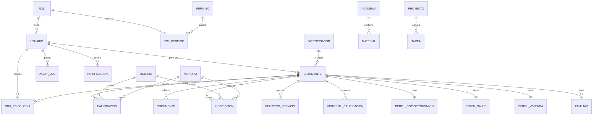

# Global Effect Nexus — Estructura sólida del proyecto

Documento de arquitectura para construir el sistema **desde los cimientos** en stack propio, apto para tesis. Toma como insumo la maqueta inicial del sistema (15 entidades + frontend React) y la convierte en una base relacional normalizada con SQL propio, capa de identidad/roles, internacionalización (i18n) y una estructura de carpetas mantenible.

Stack de datos: **PostgreSQL + `pg` (node-postgres)** — sin ORM. El SQL se escribe a mano, lo que da control total sobre tablas, índices y constraints, y alimenta directamente las entregas posteriores (Diagrama ER, Diccionario de Datos, Reglas de Negocio).

Fecha: 2026-06-22

---

## 1. Stack tecnológico 

| Capa | Prototipo inicial | Stack propio (tesis) |
|------|-------------------|----------------------|
| Framework | React 18 + Vite (SPA) | **Next.js (App Router) + TypeScript** |
| UI | Tailwind + shadcn/ui | Tailwind + shadcn/ui *(se reutiliza)* |
| Formularios | React Hook Form + Zod | React Hook Form + Zod *(se reutiliza)* |
| Gráficos | Recharts | Recharts *(se reutiliza)* |
| Datos cliente | TanStack React Query | TanStack Query + Server Actions |
| Base de datos | Entidades del diseño preliminar | **PostgreSQL + `pg` (node-postgres), SQL a mano** |
| Migraciones | — (gestionado) | `node-pg-migrate` (o runner de `.sql` numerados) |
| Validación / tipos | — | Zod en el borde + interfaces TypeScript por entidad |
| Autenticación | Usuario simple (admin/user) | **Auth.js (NextAuth v5)** credenciales + JWT, 6 roles |
| Almacenamiento | URLs gestionadas por el prototipo | Storage propio (S3/UploadThing) + tabla `documento` |
| Idiomas | Solo es-ES | **next-intl** (es / en) |
| IA | Integración del prototipo | Capa propia de servicios IA |

> Regla de oro del proyecto: **conservar el front (shadcn, RHF, Zod, Recharts) y consolidar la capa de datos** sobre PostgreSQL + `pg` + Auth.js + next-intl.

### Por qué `pg` y no un ORM (para la defensa)

- Escribes el SQL, así que **documentas y justificas** cada tabla, índice y constraint.
- Las **queries parametrizadas** (`$1`, `$2`…) son tu defensa contra inyección SQL — argumento directo para el capítulo de seguridad.
- Precio: más código repetitivo y pierdes el tipado automático de filas → se compensa con Zod + interfaces TS (§3.5).

---

## 2. Lo que el prototipo resolvía de forma básica y ahora se construye a medida

1. **Identidad y acceso (RBAC).** El prototipo solo tenía `admin/user`. Tu sistema necesita 6 roles reales y permisos granulares por módulo.
2. **Gestión de usuarios.** Alta, invitación, activación/desactivación, asociación usuario↔estudiante / usuario↔psicólogo.
3. **Almacenamiento de archivos.** Los campos `foto_url`, `expediente_url`, `archivo_url`, `imagen_habitudes_url` apuntaban a un storage externo del prototipo. Hay que montar storage propio + tabla `documento`.
4. **Campos de auditoría.** En el prototipo `id`, `created_date`, `updated_date`, `created_by_id` se inyectaban automáticamente; ahora se declaran explícitamente en el DDL. `updated_at` se mantiene con un trigger (§3.2) y las acciones sensibles van a `audit_log`.
5. **Notificaciones internas.** El inventario las menciona ("Se enviará notificación a…"); requieren tabla `notificacion`.
6. **i18n.** Textos en varios idiomas (es/en) — relevante porque los patrocinadores son internacionales.

---

## 3. Modelo de datos sólido (PostgreSQL + SQL a mano)

### 3.1 Decisiones de normalización

- **Eliminar duplicación `id` + `nombre`.** Donde el prototipo guardaba `estudiante_id` *y* `estudiante_nombre`, se deja **solo la FK** (`estudiante_id`); el nombre se obtiene por `JOIN`. Igual para `curso_*`, `patrocinador_*`, `academia_*`.
- **`tarea.proyecto` (por nombre) → `proyecto_id` (FK).**
- **Partir `estudiante` (75 campos)** en tablas hijas: `familiar`, `perfil_vivienda`, `perfil_salud`, `perfil_socioeconomico`.
- **Sacar `observaciones_psicologia` del perfil** y llevarlo al dominio Psicología (`nota_psicologica`), con acceso restringido a rol Psicólogo/Súper Admin.
- **Crear tablas que la maqueta no tenía:** `periodo`, `inscripcion` (matrícula), `documento`, `notificacion`, `audit_log`, además de `usuario`, `rol`, `permiso`, `rol_permiso`.
- **Enums** → en PostgreSQL puedes usar `CREATE TYPE ... AS ENUM` o `TEXT` + `CHECK`. Se guarda el **código**, no el texto traducido; la traducción ocurre en la UI (§4).
- Convención: nombres de tabla y columna en `snake_case`, singular para la tabla.

### 3.2 Capa de identidad y acceso (DDL — concreto)

```sql
-- db/migrations/001_identidad.sql
CREATE EXTENSION IF NOT EXISTS "pgcrypto";   -- habilita gen_random_uuid()

CREATE TABLE rol (
  id          UUID PRIMARY KEY DEFAULT gen_random_uuid(),
  nombre      TEXT NOT NULL UNIQUE,   -- super_admin, admin, docente, estudiante, psicologo, contabilidad
  descripcion TEXT
);

CREATE TABLE permiso (
  id          UUID PRIMARY KEY DEFAULT gen_random_uuid(),
  codigo      TEXT NOT NULL UNIQUE,   -- expedientes.leer, calificaciones.editar, psicologia.leer ...
  descripcion TEXT
);

CREATE TABLE rol_permiso (
  rol_id     UUID NOT NULL REFERENCES rol(id) ON DELETE CASCADE,
  permiso_id UUID NOT NULL REFERENCES permiso(id) ON DELETE CASCADE,
  PRIMARY KEY (rol_id, permiso_id)
);

CREATE TABLE usuario (
  id            UUID PRIMARY KEY DEFAULT gen_random_uuid(),
  email         TEXT NOT NULL UNIQUE,
  password_hash TEXT NOT NULL,
  nombre        TEXT NOT NULL,
  idioma        TEXT NOT NULL DEFAULT 'es',
  activo        BOOLEAN NOT NULL DEFAULT TRUE,
  rol_id        UUID NOT NULL REFERENCES rol(id),
  created_at    TIMESTAMPTZ NOT NULL DEFAULT now(),
  updated_at    TIMESTAMPTZ NOT NULL DEFAULT now()
);
CREATE INDEX idx_usuario_rol ON usuario(rol_id);
```

`updated_at` no se actualiza solo (no hay equivalente a `@updatedAt`): se usa un trigger reutilizable en cada tabla con esa columna.

```sql
CREATE OR REPLACE FUNCTION set_updated_at() RETURNS trigger AS $$
BEGIN NEW.updated_at = now(); RETURN NEW; END;
$$ LANGUAGE plpgsql;

CREATE TRIGGER trg_usuario_updated
BEFORE UPDATE ON usuario
FOR EACH ROW EXECUTE FUNCTION set_updated_at();
```

### 3.3 Estudiante normalizado (patrón de descomposición)

```sql
-- db/migrations/003_estudiante.sql
CREATE TYPE tipo_estudiante   AS ENUM ('becado', 'regular');
CREATE TYPE estado_estudiante AS ENUM ('activo', 'inactivo', 'graduado', 'suspendido');
CREATE TYPE genero            AS ENUM ('masculino', 'femenino', 'otro');
CREATE TYPE parentesco        AS ENUM ('padre','madre','tutor','madrastra','padrastro','hermano');

CREATE TABLE estudiante (
  id                    UUID PRIMARY KEY DEFAULT gen_random_uuid(),
  nombre                TEXT NOT NULL,
  cedula                TEXT,
  email                 TEXT,
  telefono              TEXT,
  fecha_nacimiento      DATE,
  genero                genero,
  nacionalidad          TEXT,
  religion              TEXT,
  foto_id               UUID REFERENCES documento(id),
  tipo                  tipo_estudiante   NOT NULL DEFAULT 'regular',
  estado                estado_estudiante NOT NULL DEFAULT 'activo',
  programa              TEXT,
  universidad           TEXT,
  fecha_ingreso         DATE,
  centro_educativo      TEXT,
  facilitador_habitudes TEXT,
  usuario_id            UUID UNIQUE REFERENCES usuario(id),
  patrocinador_id       UUID REFERENCES patrocinador(id),
  created_at            TIMESTAMPTZ NOT NULL DEFAULT now(),
  updated_at            TIMESTAMPTZ NOT NULL DEFAULT now()
);
CREATE INDEX idx_estudiante_patrocinador ON estudiante(patrocinador_id);

CREATE TABLE familiar (
  id            UUID PRIMARY KEY DEFAULT gen_random_uuid(),
  estudiante_id UUID NOT NULL REFERENCES estudiante(id) ON DELETE CASCADE,
  parentesco    parentesco NOT NULL,
  nombre        TEXT NOT NULL,
  edad          INTEGER,
  telefono      TEXT,
  profesion     TEXT
);
CREATE INDEX idx_familiar_estudiante ON familiar(estudiante_id);
```

Las 20+ columnas `padre_*`, `madre_*`, `tutor_*`, `madrastra_*`, `padrastro_*` del diseño preliminar colapsan en **una sola tabla `familiar`** con un enum `parentesco`. Misma idea, como tablas hijas 1:1 (`estudiante_id UNIQUE`):

- `perfil_vivienda`: con_quien_vive, casa_propia, tipo_casa, bano_dentro, habitaciones, camas, quienes_duermen_cama, direccion, comunidad, ciudad, pais.
- `perfil_salud`: enfermedades, alergias, contacto_emergencia_nombre, contacto_emergencia_telefono.
- `perfil_socioeconomico`: historia_de_vida, situacion_familiar, situacion_economica, motivo_beca, metas_academicas.

### 3.4 Resto del modelo (agrupado por dominio)

| Dominio | Tablas | FK clave / normalización |
|---------|--------|--------------------------|
| Identidad | `usuario`, `rol`, `permiso`, `rol_permiso` | `usuario.rol_id` → `rol` |
| Estudiante | `estudiante`, `familiar`, `perfil_vivienda`, `perfil_salud`, `perfil_socioeconomico` | hijas → `estudiante.id` |
| Académico | `periodo` *(nueva)*, `materia`, `curso`, `inscripcion` *(nueva)*, `calificacion`, `historial_calificacion` | `calificacion` → estudiante + materia + periodo |
| Academias | `academia`, `material` | `material.academia_id` → `academia` |
| Patrocinio | `patrocinador`, `asignacion_beca` *(opcional)* | `estudiante.patrocinador_id` → `patrocinador` |
| Psicología | `cita_psicologia`, `nota_psicologica` *(confidencial)* | → estudiante + usuario(psicólogo) |
| Operación | `proyecto`, `tarea`, `evento`, `registro_servicio` | `tarea.proyecto_id` → `proyecto` |
| Bienestar | `inscripcion_comida` | público (sin login) |
| Finanzas | `transaccion` | enum `tipo` (ingreso/egreso), `categoria` |
| Transversal | `documento`, `notificacion`, `audit_log` | `documento` reemplaza los campos `*_url` |

> Cada tabla con `updated_at` repite el `CREATE TRIGGER trg_<tabla>_updated ... EXECUTE FUNCTION set_updated_at();`.

### 3.5 Tipado de filas (sin ORM)

`pg` devuelve `rows` sin tipo. Defines una interfaz por entidad y validas la entrada con Zod:

```ts
// src/server/estudiantes/types.ts
export interface Estudiante {
  id: string;
  nombre: string;
  tipo: 'becado' | 'regular';
  estado: 'activo' | 'inactivo' | 'graduado' | 'suspendido';
  patrocinador_id: string | null;
  // ...
}
```

Si más adelante quieres SQL tipado sin pasar a un ORM, herramientas como `pgtyped` o `kysely-codegen` generan estos tipos desde la propia base de datos.

---

## 4. Internacionalización (i18n con next-intl)

- Segmento de ruta por idioma: `/[locale]/...` con `locale ∈ { es, en }`.
- Diccionarios en `messages/es.json` y `messages/en.json`.
- **No se traduce en la base de datos.** Los enums (`estado`, `tipo`, `prioridad`…) se guardan como código y se traducen en la UI mediante claves, p. ej. `t('estados.activo')`.
- El idioma preferido se guarda en `usuario.idioma` y se usa como default al iniciar sesión.
- Para contenido dinámico que deba ser bilingüe (raro en tesis) se añadiría una tabla `traduccion(entidad, campo, locale, texto)`; para el alcance actual basta i18n de UI.

```
messages/
├─ es.json     // { "nav": { "expedientes": "Expedientes" }, "estados": { "activo": "Activo" } }
└─ en.json     // { "nav": { "expedientes": "Records" },     "estados": { "activo": "Active" } }
```

---

## 5. Estructura de carpetas (Next.js App Router)

```
global-effect-nexus/
├─ db/
│  ├─ migrations/             # 001_identidad.sql, 002_documento.sql, 003_estudiante.sql ...
│  ├─ seed.sql                # roles, permisos y usuario admin inicial
│  └─ README.md               # cómo correr migraciones (node-pg-migrate)
├─ messages/                  # i18n (es.json, en.json)
├─ public/
├─ src/
│  ├─ app/
│  │  ├─ [locale]/            # segmento de idioma
│  │  │  ├─ (auth)/           # login, recuperar contraseña (sin sidebar)
│  │  │  │  └─ login/page.tsx
│  │  │  ├─ (portal)/         # área autenticada (sidebar + topbar)
│  │  │  │  ├─ layout.tsx     # valida sesión y rol
│  │  │  │  ├─ dashboard/
│  │  │  │  ├─ expedientes/
│  │  │  │  ├─ academico/     # cursos, materias, calificaciones, historial, periodos, prematricula
│  │  │  │  ├─ academias/     # programas, materiales
│  │  │  │  ├─ administrativo/# personal, proyectos, tareas
│  │  │  │  ├─ patrocinadores/# + becas
│  │  │  │  ├─ contabilidad/
│  │  │  │  ├─ psicologia/
│  │  │  │  ├─ calendario/
│  │  │  │  ├─ comida/
│  │  │  │  ├─ reportes/
│  │  │  │  └─ configuracion/ # usuarios, roles y permisos
│  │  │  └─ (public)/         # inicio, inscripción comida (sin login)
│  │  └─ api/
│  │     └─ auth/[...nextauth]/route.ts
│  ├─ components/
│  │  ├─ ui/                  # shadcn/ui (reutilizas los 40 componentes)
│  │  ├─ layout/              # Sidebar, TopBar, AppLayout
│  │  ├─ shared/              # StatCard, PageHeader, EmptyState, BuscadorEstudiantes
│  │  └─ expedientes/         # ExpedienteDetalle, FormFamiliar, FormSeguimiento
│  ├─ lib/
│  │  ├─ db.ts                # pool de conexiones pg (singleton)
│  │  ├─ auth.ts              # config Auth.js (credenciales + JWT)
│  │  ├─ rbac.ts              # helpers de permisos: can(usuario, 'expedientes.editar')
│  │  ├─ i18n.ts              # config next-intl
│  │  └─ utils.ts
│  ├─ server/                 # lógica de servidor por dominio
│  │  ├─ estudiantes/         # queries.ts + actions.ts + types.ts + schema.ts (zod)
│  │  ├─ academico/
│  │  ├─ psicologia/          # control de acceso estricto
│  │  └─ ...
│  ├─ hooks/
│  ├─ middleware.ts           # i18n + protección de rutas por rol
│  └─ types/
├─ .env                       # DATABASE_URL, AUTH_SECRET, etc.
├─ next.config.mjs
├─ tailwind.config.ts
└─ package.json
```

Mapeo directo: cada `pages/*.jsx` del prototipo inicial se vuelve una ruta dentro de `(portal)`; los `PortalX.jsx` se vuelven el `dashboard` que cambia según el rol; los `components/ui` de shadcn se copian tal cual.

### 5.1 Pool de conexiones

```ts
// src/lib/db.ts
import { Pool } from 'pg';

const globalForPg = globalThis as unknown as { pool?: Pool };
export const pool =
  globalForPg.pool ?? new Pool({ connectionString: process.env.DATABASE_URL });
if (process.env.NODE_ENV !== 'production') globalForPg.pool = pool;

export const query = (text: string, params?: unknown[]) => pool.query(text, params);
```

### 5.2 Capa de queries por dominio (parametrizadas)

```ts
// src/server/estudiantes/queries.ts
import { query } from '@/lib/db';
import type { Estudiante } from './types';

export async function getEstudiantePorId(id: string): Promise<Estudiante | null> {
  const { rows } = await query(
    `SELECT e.*, p.nombre AS patrocinador_nombre
       FROM estudiante e
       LEFT JOIN patrocinador p ON p.id = e.patrocinador_id
      WHERE e.id = $1`,
    [id],
  );
  return (rows[0] as Estudiante) ?? null;
}
```

> Nunca interpolar valores en el string SQL: siempre `$1, $2, ...` con el arreglo de `params`. Eso es lo que cierra la puerta a inyección SQL.

### 5.3 Autenticación

Con Auth.js usando el proveedor de **credenciales** (email + contraseña) y sesiones **JWT**, **no necesitas adaptador de base de datos ni tablas extra de Auth.js**: te basta tu tabla `usuario`. El flujo verifica el `password_hash` con `bcrypt`/`argon2` y mete `rol` y `permisos` en el token para que el `middleware` y `rbac.ts` decidan acceso por ruta.

---

## 6. ERD completo (mermaid — pégalo en mermaid.live o Lucidchart)



> El ERD del widget en el chat es el subconjunto "backbone"; este es la versión ampliada. Añade los atributos por entidad según §3 cuando lo pases a tu herramienta.

---

## 7. Impacto en el plan de 14 sprints

"Usuarios y todo eso" no era trivial: al construir la capa propia de identidad y datos, las fases de fundación crecen.

- **Sprint 0 — Fundaciones:** setup Next.js + TS, conexión `pg` a PostgreSQL, runner de migraciones (`node-pg-migrate`), **diseño del ERD completo**, DDL de identidad (`rol`/`permiso`/`usuario`), scaffolding de **i18n (next-intl)**, design tokens + shadcn.
- **Sprint 1 — Identidad y acceso:** Auth.js (credenciales + JWT), **RBAC real** (6 roles + permisos por módulo), pantalla de **Configuración** (gestión de usuarios y roles), storage de archivos + tabla `documento`, `audit_log`.

Recomendación: dado el peso de identidad + i18n + storage + SQL a mano, considera **partir la fundación en 2–3 sprints** (S0, S1a, S1b) o aceptar que el colchón de 2 semanas se consume aquí. No agrega módulos nuevos al final; reconoce trabajo que antes estaba oculto.

Orden de construcción "uno por uno" sugerido (cada módulo = migración `.sql` + queries parametrizadas + validación Zod + control de acceso por permiso + i18n):
Identidad → Expedientes (estudiante + hijas) → Académico → Patrocinadores/Becas → Contabilidad → Psicología (acceso estricto) → Operación (Proyectos/Tareas/Calendario/Comida) → Reportes/Dashboard → IA → Estabilización/Despliegue.
