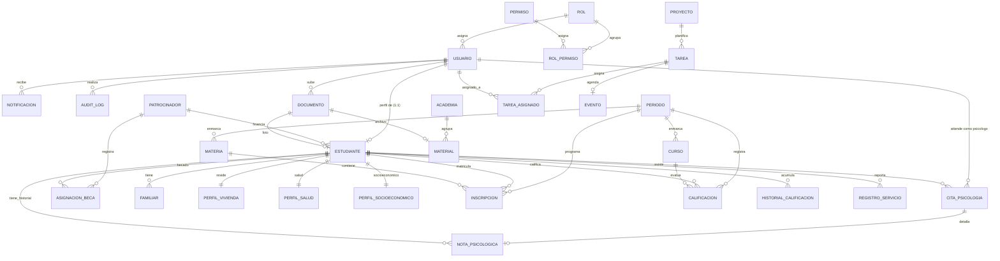

# Plan de Implementación: Base de Datos Sólida y Normalizada para Global Effect Nexus

Este documento detalla la planificación y el diseño de la base de datos relacional para el proyecto **Global Effect Nexus**, reemplazando el diseño plano de la maqueta por una base de datos PostgreSQL de grado empresarial, totalmente normalizada y escalable.

---

## 1. Enfoque SMART para el Diseño de la Base de Datos

Para asegurar el éxito del diseño e implementación de los cimientos del sistema, estructuramos la base de datos bajo la metodología **SMART**:

*   **S (Specific - Específico):** Diseñar y documentar un esquema relacional normalizado en PostgreSQL que satisfaga las necesidades operativas de los 27 módulos de la fundación, descomponiendo la entidad plana `Estudiante` (de 75 campos) y agregando seguridad RBAC nativa a nivel de tablas.
*   **M (Measurable - Medible):** Crear un esquema completo con 25 tablas relacionales que implementen claves primarias (PK) auto-generadas (UUID), claves foráneas (FK) físicas con políticas de integridad referencial, índices para consultas críticas, y triggers automáticos de auditoría (`updated_at` y `audit_log`).
*   **A (Achievable - Alcanzable):** Construir el modelo usando PostgreSQL nativo, escribiendo SQL robusto a mano (sin ORMs), lo que permite un control total del DDL/DML, queries parametrizadas seguras y compatibilidad directa con el cliente de Node-Postgres (`pg`).
*   **R (Relevant - Relevante):** Este diseño es la base indispensable de la arquitectura Next.js (App Router). Resuelve problemas de redundancia, inconsistencia de datos (ej. duplicidad de nombres junto a IDs) y de privacidad (separación estricta de expedientes de psicología).
*   **T (Time-bound - Temporal):** Entrega inmediata de este diseño para revisión y aprobación en este Sprint, sentando las bases para las migraciones automatizadas y el desarrollo de la lógica del backend.

---

## 2. Decisiones de Normalización (1NF, 2NF y 3NF)

El diseño original contenía múltiples debilidades estructurales que impedían la escalabilidad y ponían en riesgo la integridad de los datos. Se han aplicado las siguientes formas de normalización:

### Primera Forma Normal (1NF)
*   **Eliminación de Grupos Repetitivos:** Los campos de hermanos (`hermanos_edades`, `hermanas_edades`) y familiares en general se almacenaban en cadenas de texto plano. Esto se normaliza en una tabla separada `familiar` con una relación de `1:N`.
*   **Eliminación de Listas Delimitadas:** Los correos de asignados en las tareas (`asignados_emails`) se almacenaban como arreglos de texto en el diseño preliminar. Se normalizan en una tabla de unión `tarea_asignado` (`N:M`) que relaciona tareas y usuarios de forma física.

### Segunda Forma Normal (2NF)
*   **Dependencia Completa:** La entidad `Estudiante` contenía 75 campos mezclando datos personales, de vivienda, médicos y socioeconómicos. Esto generaba que la mayoría de los campos no tuvieran una relación directa con la clave primaria de la entidad core. Se realiza una **descomposición de la tabla Estudiante** en sub-tablas `1:1`:
    1.  `estudiante` (Datos personales básicos y académicos activos).
    2.  `familiar` (`1:N`, colapsa las 20+ columnas redundantes de `padre_*`, `madre_*`, `tutor_*`, etc., en una estructura limpia con un enum `parentesco`).
    3.  `perfil_vivienda` (`1:1` con la residencia y condiciones del hogar).
    4.  `perfil_salud` (`1:1` con alergias, enfermedades e información de emergencias).
    5.  `perfil_socioeconomico` (`1:1` con historia de vida, motivo de beca, situación familiar/económica).

### Tercera Forma Normal (3NF)
*   **Eliminación de Dependencias Transitivas:** Se elimina la duplicación de guardar `estudiante_nombre` junto a `estudiante_id`, `curso_nombre` junto a `curso_id`, o `patrocinador_nombre` junto a `patrocinador_id`. Las tablas ahora solo guardan el ID (FK) y la información del nombre se obtiene en tiempo de consulta mediante `JOIN`s, evitando anomalías de actualización.
*   **Aislamiento de Seguridad:** El campo `observaciones_psicologia` se extrae por completo del expediente general del estudiante y se mueve a la tabla confidencial `nota_psicologica` vinculada a `cita_psicologia`, protegiendo la confidencialidad médica.

---

## 3. Esquema Relacional Completo (DDL PostgreSQL)

A continuación, se detalla el script DDL de creación de tablas. Este script incluye enums, triggers automatizados para `updated_at`, índices para mejorar el rendimiento de búsquedas frecuentes, y claves foráneas explícitas.

```sql
-- Habilitar extensión para UUIDs auto-generados
CREATE EXTENSION IF NOT EXISTS "pgcrypto";

-- ================================================================
-- DOMINIO DE IDENTIDAD Y ACCESO (RBAC)
-- ================================================================

CREATE TABLE rol (
  id          UUID PRIMARY KEY DEFAULT gen_random_uuid(),
  nombre      TEXT NOT NULL UNIQUE, -- super_admin, admin, docente, estudiante, psicologo, contabilidad
  descripcion TEXT,
  created_at  TIMESTAMPTZ NOT NULL DEFAULT now(),
  updated_at  TIMESTAMPTZ NOT NULL DEFAULT now()
);

CREATE TABLE permiso (
  id          UUID PRIMARY KEY DEFAULT gen_random_uuid(),
  codigo      TEXT NOT NULL UNIQUE, -- ej: 'expedientes.leer', 'calificaciones.editar'
  descripcion TEXT,
  created_at  TIMESTAMPTZ NOT NULL DEFAULT now(),
  updated_at  TIMESTAMPTZ NOT NULL DEFAULT now()
);

CREATE TABLE rol_permiso (
  rol_id     UUID NOT NULL REFERENCES rol(id) ON DELETE CASCADE,
  permiso_id UUID NOT NULL REFERENCES permiso(id) ON DELETE CASCADE,
  PRIMARY KEY (rol_id, permiso_id)
);

CREATE TABLE usuario (
  id            UUID PRIMARY KEY DEFAULT gen_random_uuid(),
  email         TEXT NOT NULL UNIQUE,
  password_hash TEXT NOT NULL,
  nombre        TEXT NOT NULL,
  idioma        TEXT NOT NULL DEFAULT 'es',
  activo        BOOLEAN NOT NULL DEFAULT TRUE,
  rol_id        UUID NOT NULL REFERENCES rol(id),
  created_at    TIMESTAMPTZ NOT NULL DEFAULT now(),
  updated_at    TIMESTAMPTZ NOT NULL DEFAULT now()
);
CREATE INDEX idx_usuario_rol ON usuario(rol_id);
CREATE INDEX idx_usuario_email ON usuario(email);

-- ================================================================
-- DOMINIO TRANSVERSAL DE SOPORTE E HISTORIAL
-- ================================================================

CREATE TABLE documento (
  id            UUID PRIMARY KEY DEFAULT gen_random_uuid(),
  nombre        TEXT NOT NULL,
  storage_key   TEXT NOT NULL UNIQUE, -- Identificador único en S3/UploadThing
  tipo          TEXT,                 -- foto, expediente_escaneado, material_educativo, etc.
  mime          TEXT,
  tamano_bytes  BIGINT,
  subido_por_id UUID REFERENCES usuario(id) ON DELETE SET NULL,
  created_at    TIMESTAMPTZ NOT NULL DEFAULT now()
);

CREATE TABLE notificacion (
  id         UUID PRIMARY KEY DEFAULT gen_random_uuid(),
  usuario_id UUID NOT NULL REFERENCES usuario(id) ON DELETE CASCADE,
  titulo     TEXT NOT NULL,
  mensaje    TEXT NOT NULL,
  tipo       TEXT DEFAULT 'info', -- info, alerta, tarea
  leida      BOOLEAN NOT NULL DEFAULT FALSE,
  created_at TIMESTAMPTZ NOT NULL DEFAULT now()
);
CREATE INDEX idx_notificacion_usuario_leida ON notificacion(usuario_id, leida);

CREATE TABLE audit_log (
  id         UUID PRIMARY KEY DEFAULT gen_random_uuid(),
  usuario_id UUID REFERENCES usuario(id) ON DELETE SET NULL,
  accion     TEXT NOT NULL,
  entidad    TEXT NOT NULL,
  entidad_id UUID,
  datos      JSONB, -- Cambios en formato {antes: {...}, despues: {...}}
  created_at TIMESTAMPTZ NOT NULL DEFAULT now()
);
CREATE INDEX idx_audit_log_entidad ON audit_log(entidad, entidad_id);

-- ================================================================
-- DOMINIO DE PATROCINADORES
-- ================================================================

CREATE TYPE tipo_patrocinador AS ENUM ('empresa', 'persona', 'iglesia', 'ong', 'otro');

CREATE TABLE patrocinador (
  id            UUID PRIMARY KEY DEFAULT gen_random_uuid(),
  nombre        TEXT NOT NULL,
  tipo          tipo_patrocinador NOT NULL DEFAULT 'persona',
  email         TEXT,
  telefono      TEXT,
  pais          TEXT,
  estado        TEXT NOT NULL DEFAULT 'activo', -- activo, inactivo
  monto_mensual NUMERIC(10,2) DEFAULT 0.00,    -- Aporte mensual promedio
  notas         TEXT,
  created_at    TIMESTAMPTZ NOT NULL DEFAULT now(),
  updated_at    TIMESTAMPTZ NOT NULL DEFAULT now()
);

-- ================================================================
-- DOMINIO DE ESTUDIANTES (EXPEDIENTES NORMALIZADOS)
-- ================================================================

CREATE TYPE tipo_estudiante AS ENUM ('becado', 'regular');
CREATE TYPE estado_estudiante AS ENUM ('reclutado', 'postulado', 'academia_liderazgo', 'standby_tecnico', 'activo', 'inactivo', 'graduado', 'suspendido');
CREATE TYPE genero AS ENUM ('masculino', 'femenino', 'otro');
CREATE TYPE parentesco AS ENUM ('padre', 'madre', 'tutor', 'madrastra', 'padrastro', 'hermano', 'hermana', 'otro');

CREATE TABLE estudiante (
  id                       UUID PRIMARY KEY DEFAULT gen_random_uuid(),
  nombre                   TEXT NOT NULL,
  cedula                   TEXT UNIQUE,
  email                    TEXT,
  telefono                 TEXT,
  fecha_nacimiento         DATE,
  genero                   genero,
  nacionalidad             TEXT DEFAULT 'Dominicana',
  religion                 TEXT,
  foto_id                  UUID REFERENCES documento(id) ON DELETE SET NULL,
  tipo                     tipo_estudiante NOT NULL DEFAULT 'regular',
  estado                   estado_estudiante NOT NULL DEFAULT 'activo',
  programa                 TEXT,                     -- Qué carrera/técnico estudia
  universidad              TEXT,                     -- Dónde estudia (sólo becados)
  fecha_ingreso            DATE,
  centro_educativo         TEXT,                     -- Escuela de origen
  director_centro          TEXT,                     -- Director de escuela de origen
  facilitador_habitudes    TEXT,                     -- Facilitador del programa Habitudes
  imagen_habitudes_id      UUID REFERENCES documento(id) ON DELETE SET NULL,
  breve_historia_habitudes TEXT,
  usuario_id               UUID UNIQUE REFERENCES usuario(id) ON DELETE SET NULL, -- Vinculación con credenciales
  patrocinador_id          UUID REFERENCES patrocinador(id) ON DELETE SET NULL,     -- Patrocinador activo
  created_at               TIMESTAMPTZ NOT NULL DEFAULT now(),
  updated_at               TIMESTAMPTZ NOT NULL DEFAULT now()
);
CREATE INDEX idx_estudiante_estado ON estudiante(estado);
CREATE INDEX idx_estudiante_patrocinador ON estudiante(patrocinador_id);

-- Tabla 1:N para Familiares (Elimina columnas planas de padre, madre, hermanos, etc.)
CREATE TABLE familiar (
  id            UUID PRIMARY KEY DEFAULT gen_random_uuid(),
  estudiante_id UUID NOT NULL REFERENCES estudiante(id) ON DELETE CASCADE,
  parentesco    parentesco NOT NULL,
  nombre        TEXT NOT NULL,
  edad          INTEGER,
  telefono      TEXT,
  profesion     TEXT
);
CREATE INDEX idx_familiar_estudiante ON familiar(estudiante_id);

-- Perfil de Vivienda (1:1)
CREATE TABLE perfil_vivienda (
  estudiante_id                UUID PRIMARY KEY REFERENCES estudiante(id) ON DELETE CASCADE,
  con_quien_vive               TEXT,
  por_que_vive_con_esa_persona TEXT,
  casa_propia                  TEXT, -- sí, no, alquilada, prestada
  tipo_casa                    TEXT,
  bano_dentro                  TEXT, -- dentro, fuera
  habitaciones                 INTEGER DEFAULT 0,
  camas                        INTEGER DEFAULT 0,
  quienes_duermen_cama         TEXT,
  direccion                    TEXT,
  comunidad                    TEXT,
  ciudad                       TEXT,
  pais                         TEXT DEFAULT 'República Dominicana'
);

-- Perfil de Salud (1:1)
CREATE TABLE perfil_salud (
  estudiante_id                UUID PRIMARY KEY REFERENCES estudiante(id) ON DELETE CASCADE,
  enfermedades                 TEXT,
  alergias                     TEXT,
  contacto_emergencia_nombre   TEXT,
  contacto_emergencia_telefono TEXT
);

-- Perfil Socioeconómico y Proyecto de Vida (1:1)
CREATE TABLE perfil_socioeconomico (
  estudiante_id       UUID PRIMARY KEY REFERENCES estudiante(id) ON DELETE CASCADE,
  historia_de_vida    TEXT,
  situacion_familiar  TEXT,
  situacion_economica TEXT,
  motivo_beca         TEXT,
  metas_academicas    TEXT
);

-- Historial de asignaciones de becas (Para auditorías financieras)
CREATE TABLE asignacion_beca (
  id              UUID PRIMARY KEY DEFAULT gen_random_uuid(),
  estudiante_id   UUID NOT NULL REFERENCES estudiante(id) ON DELETE CASCADE,
  patrocinador_id UUID NOT NULL REFERENCES patrocinador(id) ON DELETE CASCADE,
  monto           NUMERIC(10,2) NOT NULL,
  fecha_inicio    DATE NOT NULL DEFAULT CURRENT_DATE,
  fecha_fin       DATE,
  estado          TEXT NOT NULL DEFAULT 'activo', -- activo, finalizado
  created_at      TIMESTAMPTZ NOT NULL DEFAULT now()
);
CREATE INDEX idx_asignacion_beca_estudiante ON asignacion_beca(estudiante_id);

-- ================================================================
-- DOMINIO ACADÉMICO (CURSOS, MATERIAS Y NOTAS)
-- ================================================================

CREATE TABLE periodo (
  id           UUID PRIMARY KEY DEFAULT gen_random_uuid(),
  nombre       TEXT NOT NULL UNIQUE, -- ej: '2026-I', '2026-II'
  fecha_inicio DATE NOT NULL,
  fecha_fin    DATE NOT NULL,
  estado       TEXT NOT NULL DEFAULT 'planificado', -- planificado, activo, completado
  created_at   TIMESTAMPTZ NOT NULL DEFAULT now(),
  updated_at   TIMESTAMPTZ NOT NULL DEFAULT now()
);

CREATE TABLE materia (
  id              UUID PRIMARY KEY DEFAULT gen_random_uuid(),
  nombre          TEXT NOT NULL,
  codigo          TEXT,
  descripcion     TEXT,
  periodo_id      UUID REFERENCES periodo(id) ON DELETE SET NULL,
  creditos        INTEGER DEFAULT 3,
  profesor_nombre TEXT,
  estado          TEXT NOT NULL DEFAULT 'activa', -- activa, inactiva
  horario         TEXT,
  aula            TEXT,
  created_at      TIMESTAMPTZ NOT NULL DEFAULT now(),
  updated_at      TIMESTAMPTZ NOT NULL DEFAULT now()
);
CREATE INDEX idx_materia_periodo ON materia(periodo_id);

CREATE TABLE curso (
  id           UUID PRIMARY KEY DEFAULT gen_random_uuid(),
  nombre       TEXT NOT NULL, -- Cursos técnicos
  descripcion  TEXT,
  docente      TEXT,
  periodo_id   UUID REFERENCES periodo(id) ON DELETE SET NULL,
  estado       TEXT NOT NULL DEFAULT 'activo', -- activo, finalizado, planificado
  capacidad    INTEGER DEFAULT 30,
  inscritos    INTEGER DEFAULT 0,
  horario      TEXT,
  modalidad    TEXT NOT NULL DEFAULT 'presencial', -- presencial, virtual, mixto
  created_at   TIMESTAMPTZ NOT NULL DEFAULT now(),
  updated_at   TIMESTAMPTZ NOT NULL DEFAULT now()
);

-- Tabla de Matrícula/Inscripción de materias regulares
CREATE TABLE inscripcion (
  id            UUID PRIMARY KEY DEFAULT gen_random_uuid(),
  estudiante_id UUID NOT NULL REFERENCES estudiante(id) ON DELETE CASCADE,
  materia_id    UUID NOT NULL REFERENCES materia(id) ON DELETE CASCADE,
  periodo_id    UUID NOT NULL REFERENCES periodo(id) ON DELETE CASCADE,
  estado        TEXT NOT NULL DEFAULT 'activa', -- activa, retirada, aprobada, reprobada
  created_at    TIMESTAMPTZ NOT NULL DEFAULT now(),
  UNIQUE (estudiante_id, materia_id, periodo_id)
);
CREATE INDEX idx_inscripcion_estudiante ON inscripcion(estudiante_id);

CREATE TYPE tipo_evaluacion AS ENUM ('examen', 'tarea', 'proyecto', 'participacion', 'final');

-- Registro detallado de calificaciones por período
CREATE TABLE calificacion (
  id              UUID PRIMARY KEY DEFAULT gen_random_uuid(),
  estudiante_id   UUID NOT NULL REFERENCES estudiante(id) ON DELETE CASCADE,
  curso_id        UUID NOT NULL REFERENCES curso(id) ON DELETE CASCADE, -- Cursos técnicos
  periodo_id      UUID NOT NULL REFERENCES periodo(id) ON DELETE CASCADE,
  nota            NUMERIC(5,2) NOT NULL CHECK (nota >= 0.00 AND nota <= 100.00),
  tipo_evaluacion tipo_evaluacion NOT NULL DEFAULT 'examen',
  observaciones   TEXT,
  created_at      TIMESTAMPTZ NOT NULL DEFAULT now(),
  updated_at      TIMESTAMPTZ NOT NULL DEFAULT now()
);
CREATE INDEX idx_calificacion_estudiante ON calificacion(estudiante_id);

-- Historial Académico Consolidado (Tesis/Expediente General)
CREATE TABLE historial_calificacion (
  id            UUID PRIMARY KEY DEFAULT gen_random_uuid(),
  estudiante_id UUID NOT NULL REFERENCES estudiante(id) ON DELETE CASCADE,
  cuatrimestre  TEXT NOT NULL, -- ej: '2025-I'
  materia       TEXT NOT NULL, -- nombre físico de la materia
  nota_numerica NUMERIC(5,2) NOT NULL CHECK (nota_numerica >= 0.00 AND nota_numerica <= 100.00),
  nota_letra    TEXT NOT NULL, -- A, B, C, D, F
  gpa           NUMERIC(3,2) NOT NULL CHECK (gpa >= 0.00 AND gpa <= 4.00),
  estado        TEXT NOT NULL DEFAULT 'aprobada', -- aprobada, prueba_academica, reprobada
  created_at    TIMESTAMPTZ NOT NULL DEFAULT now()
);
CREATE INDEX idx_historial_estudiante ON historial_calificacion(estudiante_id);

-- ================================================================
-- DOMINIO DE ACADEMIAS (LIDERAZGO Y DESARROLLO)
-- ================================================================

CREATE TABLE academia (
  id            UUID PRIMARY KEY DEFAULT gen_random_uuid(),
  nombre        TEXT NOT NULL,
  tipo          TEXT NOT NULL DEFAULT 'liderazgo', -- liderazgo, habilidades, otro
  descripcion   TEXT,
  facilitador   TEXT,
  estado        TEXT NOT NULL DEFAULT 'activa', -- activa, inactiva, planificada
  participantes INTEGER DEFAULT 0,
  fecha_inicio  DATE,
  fecha_fin     DATE,
  created_at    TIMESTAMPTZ NOT NULL DEFAULT now(),
  updated_at    TIMESTAMPTZ NOT NULL DEFAULT now()
);

CREATE TABLE material (
  id           UUID PRIMARY KEY DEFAULT gen_random_uuid(),
  titulo       TEXT NOT NULL,
  descripcion  TEXT,
  academia_id  UUID NOT NULL REFERENCES academia(id) ON DELETE CASCADE,
  tipo         TEXT NOT NULL DEFAULT 'documento', -- documento, video, presentacion, enlace, otro
  documento_id UUID REFERENCES documento(id) ON DELETE SET NULL, -- Referencia a tabla documento
  autor        TEXT,
  created_at   TIMESTAMPTZ NOT NULL DEFAULT now(),
  updated_at   TIMESTAMPTZ NOT NULL DEFAULT now()
);

-- ================================================================
-- DOMINIO DE PSICOLOGÍA
-- ================================================================

CREATE TABLE cita_psicologia (
  id                     UUID PRIMARY KEY DEFAULT gen_random_uuid(),
  estudiante_id          UUID NOT NULL REFERENCES estudiante(id) ON DELETE CASCADE,
  psicologo_id           UUID REFERENCES usuario(id) ON DELETE SET NULL,
  tipo_registro          TEXT NOT NULL DEFAULT 'cita', -- cita, seguimiento, evaluacion
  fecha                  DATE NOT NULL,
  hora                   TEXT,
  nivel_confidencialidad TEXT NOT NULL DEFAULT 'medio', -- alto, medio, bajo
  estado                 TEXT NOT NULL DEFAULT 'programada', -- programada, completada, cancelada
  riesgos                TEXT, -- Riesgos detectados (ej: ansiedad, adaptación)
  created_at             TIMESTAMPTZ NOT NULL DEFAULT now(),
  updated_at             TIMESTAMPTZ NOT NULL DEFAULT now()
);
CREATE INDEX idx_cita_psico_estudiante ON cita_psicologia(estudiante_id);

-- Tabla CONFIDENCIAL separada para notas de sesiones de psicología
CREATE TABLE nota_psicologica (
  id            UUID PRIMARY KEY DEFAULT gen_random_uuid(),
  cita_id       UUID REFERENCES cita_psicologia(id) ON DELETE CASCADE,
  estudiante_id UUID NOT NULL REFERENCES estudiante(id) ON DELETE CASCADE,
  contenido     TEXT NOT NULL, -- Contenido estrictamente confidencial
  creado_por_id UUID REFERENCES usuario(id) ON DELETE SET NULL,
  created_at    TIMESTAMPTZ NOT NULL DEFAULT now()
);

-- Expediente o perfil psicológico detallado (1:1 con estudiante, para becados universitarios)
CREATE TABLE perfil_psicologico (
  estudiante_id           UUID PRIMARY KEY REFERENCES estudiante(id) ON DELETE CASCADE,
  antecedentes_clinicos   TEXT,
  evaluacion_inicial      TEXT,
  recomendaciones_terap   TEXT,
  estado_emocional        TEXT,
  observaciones_generales TEXT,
  created_at              TIMESTAMPTZ NOT NULL DEFAULT now(),
  updated_at              TIMESTAMPTZ NOT NULL DEFAULT now()
);

-- ================================================================
-- DOMINIO DE PROYECTOS, TAREAS Y EVENTOS
-- ================================================================

CREATE TABLE proyecto (
  id           UUID PRIMARY KEY DEFAULT gen_random_uuid(),
  nombre       TEXT NOT NULL,
  descripcion  TEXT,
  responsable  TEXT,
  estado       TEXT NOT NULL DEFAULT 'planificacion', -- planificacion, en_curso, completado, pausado
  fecha_inicio DATE,
  fecha_fin    DATE,
  progreso     INTEGER DEFAULT 0 CHECK (progreso >= 0 AND progreso <= 100),
  created_at   TIMESTAMPTZ NOT NULL DEFAULT now(),
  updated_at   TIMESTAMPTZ NOT NULL DEFAULT now()
);

CREATE TABLE tarea (
  id           UUID PRIMARY KEY DEFAULT gen_random_uuid(),
  titulo       TEXT NOT NULL,
  descripcion  TEXT,
  proyecto_id  UUID REFERENCES proyecto(id) ON DELETE SET NULL,
  visibilidad  TEXT NOT NULL DEFAULT 'asignados', -- todos, asignados
  estado       TEXT NOT NULL DEFAULT 'pendiente', -- pendiente, en_progreso, completada, cancelada
  prioridad    TEXT NOT NULL DEFAULT 'media',      -- baja, media, alta, urgente
  fecha_limite DATE,
  created_at   TIMESTAMPTZ NOT NULL DEFAULT now(),
  updated_at   TIMESTAMPTZ NOT NULL DEFAULT now()
);
CREATE INDEX idx_tarea_proyecto ON tarea(proyecto_id);

-- Tabla de Asignación N:M para Tareas (Normaliza la asignación múltiple de correos/usuarios)
CREATE TABLE tarea_asignado (
  tarea_id   UUID NOT NULL REFERENCES tarea(id) ON DELETE CASCADE,
  usuario_id UUID NOT NULL REFERENCES usuario(id) ON DELETE CASCADE,
  PRIMARY KEY (tarea_id, usuario_id)
);

CREATE TABLE evento (
  id          UUID PRIMARY KEY DEFAULT gen_random_uuid(),
  titulo      TEXT NOT NULL,
  descripcion TEXT,
  tipo        TEXT NOT NULL DEFAULT 'otro', -- academico, administrativo, social, reunion, otro
  fecha       DATE NOT NULL,
  hora_inicio TEXT,
  hora_fin    TEXT,
  ubicacion   TEXT,
  responsable TEXT,
  estado      TEXT NOT NULL DEFAULT 'programado', -- programado, en_curso, completado, cancelado
  tarea_id    UUID REFERENCES tarea(id) ON DELETE SET NULL, -- Si fue autogenerado por una tarea
  created_at  TIMESTAMPTZ NOT NULL DEFAULT now(),
  updated_at  TIMESTAMPTZ NOT NULL DEFAULT now()
);
CREATE INDEX idx_evento_fecha ON evento(fecha);

-- Registro mensual de asistencia y servicio estudiantil
CREATE TABLE registro_servicio (
  id            UUID PRIMARY KEY DEFAULT gen_random_uuid(),
  estudiante_id UUID NOT NULL REFERENCES estudiante(id) ON DELETE CASCADE,
  mes           TEXT NOT NULL, -- Formato YYYY-MM
  hizo_servicio BOOLEAN NOT NULL DEFAULT FALSE,
  asistio_reunion BOOLEAN NOT NULL DEFAULT FALSE,
  notas         TEXT,
  created_at    TIMESTAMPTZ NOT NULL DEFAULT now(),
  UNIQUE (estudiante_id, mes)
);
CREATE INDEX idx_reg_servicio_estudiante ON registro_servicio(estudiante_id);

-- ================================================================
-- DOMINIO DE BIENESTAR (COMIDA PÚBLICA)
-- ================================================================

CREATE TABLE inscripcion_comida (
  id               UUID PRIMARY KEY DEFAULT gen_random_uuid(),
  nombre           TEXT NOT NULL,
  fecha            DATE NOT NULL DEFAULT CURRENT_DATE,
  hora_inscripcion TEXT NOT NULL DEFAULT (to_char(CURRENT_TIMESTAMP, 'HH24:MI:SS')),
  confirmado       BOOLEAN NOT NULL DEFAULT TRUE,
  created_at       TIMESTAMPTZ NOT NULL DEFAULT now(),
  UNIQUE (nombre, fecha)
);
CREATE INDEX idx_comida_fecha ON inscripcion_comida(fecha);

-- ================================================================
-- DOMINIO DE FINANZAS
-- ================================================================

CREATE TABLE transaccion (
  id         UUID PRIMARY KEY DEFAULT gen_random_uuid(),
  concepto   TEXT NOT NULL,
  tipo       TEXT NOT NULL CHECK (tipo IN ('ingreso', 'egreso')),
  monto      NUMERIC(10,2) NOT NULL CHECK (monto > 0.00),
  categoria  TEXT NOT NULL DEFAULT 'otro', -- beca, donacion, operativo, salario, material, evento, otro
  fecha      DATE NOT NULL DEFAULT CURRENT_DATE,
  referencia TEXT,
  notas      TEXT,
  created_at TIMESTAMPTZ NOT NULL DEFAULT now(),
  updated_at TIMESTAMPTZ NOT NULL DEFAULT now()
);
CREATE INDEX idx_transaccion_fecha ON transaccion(fecha);


-- ================================================================
-- TRIGGERS Y FUNCIONES REUTILIZABLES (AUDITORÍA)
-- ================================================================

-- Función para actualizar la columna updated_at automáticamente
CREATE OR REPLACE FUNCTION set_updated_at() 
RETURNS trigger AS $$
BEGIN 
  NEW.updated_at = now(); 
  RETURN NEW; 
END;
$$ LANGUAGE plpgsql;

-- Vinculación del trigger set_updated_at en las tablas correspondientes
CREATE TRIGGER trg_rol_updated BEFORE UPDATE ON rol FOR EACH ROW EXECUTE FUNCTION set_updated_at();
CREATE TRIGGER trg_permiso_updated BEFORE UPDATE ON permiso FOR EACH ROW EXECUTE FUNCTION set_updated_at();
CREATE TRIGGER trg_usuario_updated BEFORE UPDATE ON usuario FOR EACH ROW EXECUTE FUNCTION set_updated_at();
CREATE TRIGGER trg_patrocinador_updated BEFORE UPDATE ON patrocinador FOR EACH ROW EXECUTE FUNCTION set_updated_at();
CREATE TRIGGER trg_estudiante_updated BEFORE UPDATE ON estudiante FOR EACH ROW EXECUTE FUNCTION set_updated_at();
CREATE TRIGGER trg_periodo_updated BEFORE UPDATE ON periodo FOR EACH ROW EXECUTE FUNCTION set_updated_at();
CREATE TRIGGER trg_materia_updated BEFORE UPDATE ON materia FOR EACH ROW EXECUTE FUNCTION set_updated_at();
CREATE TRIGGER trg_curso_updated BEFORE UPDATE ON curso FOR EACH ROW EXECUTE FUNCTION set_updated_at();
CREATE TRIGGER trg_calificacion_updated BEFORE UPDATE ON calificacion FOR EACH ROW EXECUTE FUNCTION set_updated_at();
CREATE TRIGGER trg_academia_updated BEFORE UPDATE ON academia FOR EACH ROW EXECUTE FUNCTION set_updated_at();
CREATE TRIGGER trg_material_updated BEFORE UPDATE ON material FOR EACH ROW EXECUTE FUNCTION set_updated_at();
CREATE TRIGGER trg_cita_psico_updated BEFORE UPDATE ON cita_psicologia FOR EACH ROW EXECUTE FUNCTION set_updated_at();
CREATE TRIGGER trg_proyecto_updated BEFORE UPDATE ON proyecto FOR EACH ROW EXECUTE FUNCTION set_updated_at();
CREATE TRIGGER trg_tarea_updated BEFORE UPDATE ON tarea FOR EACH ROW EXECUTE FUNCTION set_updated_at();
CREATE TRIGGER trg_evento_updated BEFORE UPDATE ON evento FOR EACH ROW EXECUTE FUNCTION set_updated_at();
CREATE TRIGGER trg_transaccion_updated BEFORE UPDATE ON transaccion FOR EACH ROW EXECUTE FUNCTION set_updated_at();
CREATE TRIGGER trg_perfil_psico_updated BEFORE UPDATE ON perfil_psicologico FOR EACH ROW EXECUTE FUNCTION set_updated_at();
```

---

## 4. Diagrama de Entidad-Relación (ERD)

Este diagrama representa visualmente las dependencias físicas entre tablas, enfocándose en la normalización 1:1 y 1:N del expediente de los estudiantes, la capa de identidad RBAC y las relaciones del negocio académico:



---

## 5. Estrategia de Migración y Sembrado Inicial (`seed.sql`)

Para garantizar que el entorno sea medible y funcional desde el primer despliegue, utilizaremos archivos `.sql` secuenciales (migraciones) y un script `seed.sql` que inicializa los siguientes elementos:

1.  **Roles y Permisos:** Alta de los 6 roles institucionales (`super_admin`, `admin`, `docente`, `estudiante`, `psicologo`, `contabilidad`) y sus respectivos mapeos con permisos (`expedientes.*`, `psicologia.leer`, `finanzas.editar`, etc.).
2.  **Usuario Administrador Maestro:** Inserción de un usuario de control con rol `super_admin`, contraseña cifrada con un hash de prueba (ej: `$2b$10$...` simulación de bcrypt) y el idioma por defecto configurado.
3.  **Datos Académicos de Prueba:** Sembrado de al menos un período activo (`2026-I`), dos materias (`Matemáticas Básicas` e `Inglés Técnico`), y un patrocinador institucional ficticio para verificar el enlazado del flujo inicial.

---

## 6. Plan de Sprints Actualizado (Foco en Base de Datos)

Proponemos mantener la secuencia del plan original, pero ejecutando la fase de base de datos en los primeros sprints de manera prioritaria:

*   **Sprint 0 (Actual):** Aprobación del diseño del ERD, diccionario de datos y esquema DDL. Inicialización de Next.js y configuración del Pool de conexiones.
*   **Sprint 1:** Despliegue de migraciones del Dominio de Identidad, RBAC, Transversales, y `seed.sql`. Configuración de Auth.js (sesiones y roles).
*   **Sprint 2:** Despliegue de migraciones del Dominio de Estudiantes (expediente completo normalizado en 5 tablas) y Académico (materias, cursos, calificaciones y matrículas).
*   **Sprint 3:** Despliegue de migraciones de los dominios restantes (Patrocinadores, Psicología, Finanzas, Operaciones y Bienestar).

---

## 7. Plan de Verificación

Para corroborar que los cambios en la base de datos cumplen con los estándares de escalabilidad y corrección técnica:

### Pruebas Automatizadas
*   Correr el script SQL DDL en una instancia local de PostgreSQL para verificar que no haya errores de sintaxis o referencias circulares.
*   Ejecutar queries de prueba (`INSERT`, `SELECT JOIN`, `UPDATE`) para comprobar el correcto funcionamiento de las FK y la auto-actualización de triggers de `updated_at`.
*   Verificar restricciones de chequeo (`CHECK` en montos negativos o notas fuera de rango 0-100).

### Pruebas Manuales
*   Inspección visual del ERD generado en herramientas como DBeaver o pgAdmin.
*   Simulación de eliminación en cascada (`ON DELETE CASCADE`) eliminando un estudiante de prueba y comprobando que sus familiares, perfiles de salud, vivienda y socioeconómicos se limpien automáticamente.
